# SSF 쇼핑몰 고객 페이지

React 기반의 쇼핑몰 서비스로, 고객은 상품을 장바구니에 담아 주문하고 결제를 진행할 수 있습니다.

Node.js 기반의 서버와 WebSocket, KakaoPay 결제 시스템을 연동했으며 **실시간 알림**, **리뷰**, **배송 확인** 기능 등을 제공합니다.

> 📁 본 저장소는 프론트엔드(client)와 백엔드(server)가 함께 포함된 monorepo 형태입니다.
> 

---

## 🖥️ 프로젝트 소개

기존 SSF 홈페이지를 구현한 의류 쇼핑몰 홈페이지

## 🕰️ 개발 기간

2025-02-17 ~ 2025-03-14

## ✒️ 프로젝트 목표

1. REACT를 활용한 UI/UX 구현으로 SPA방식으로 빠른 UI 렌더링과 반응성 구현하기
2. 데이터 CRUD와 다양한 이벤트 처리 기능을 구현하여 비즈니스 로직 학습하기
3. MySQL을 활용한 데이터 관리
4. Client와 Server, DB간의 연동 경험

## **🗂️ 전체 구조도**

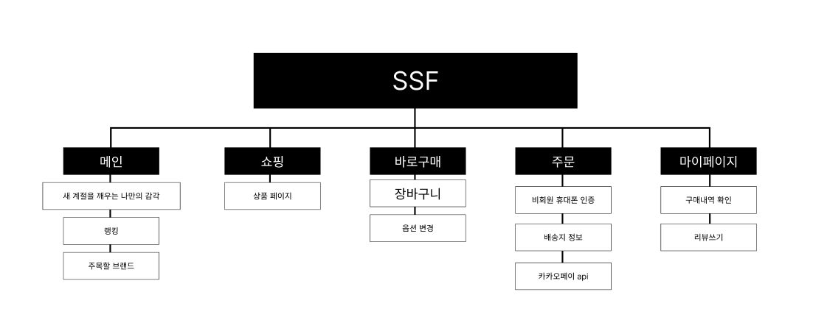


## 📋 ERD

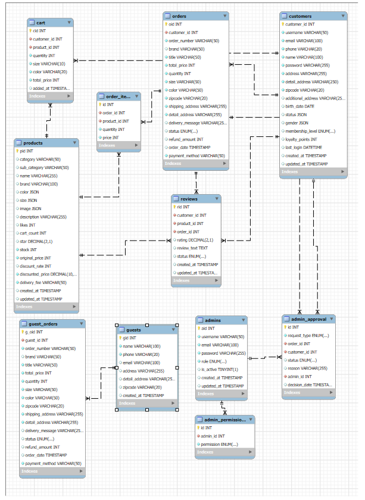

## 🛍️ 주요 기능

### 🔐 인증 및 회원가입

- 회원가입 및 로그인 (JWT 기반)
- 회원 로그인(or 비회원 로그인) 시 인증 토큰 발급 및 저장 (localStorage)

### 🖥️ 메인페이지

- 이미지 슬라이드 (swiper)
- DB연동 하여 제품 정보 조회 후 상품 출력
- 컴포넌트 분리하여 UI 및 CSS 구현


### 📦 상품 상세페이지

- 상품명, 리뷰개수, 가격정보 출력
- 상품 상세정보, 사이즈, 리뷰, 추천 메뉴 하단 제공


### 🔍 검색

- 메인에서 검색 키워드 입력 시 해당 상품 목록 출력


### 🛒 쇼핑/결제 기능

- 메인 페이지에서 상품 목록 확인
- 상품 클릭 시 상세 페이지 이동 (옵션 선택 가능)
- 장바구니 기능: 여러 상품 담기 / 수량 및 옵션 변경 / 한 번에 주문
- **바로 구매 기능: 개별 상품만 즉시 주문 가능**
- **비회원 구매 가능: 로그인 없이도 상품 구매 및 KakaoPay 결제 진행 가능**
- 결제: KakaoPay API 연동
- 결제 완료 시 → 마이페이지(회원) 또는 비회원 주문 완료 페이지로 이동

### ✅ 마이페이지 기능

- 주문 내역 확인
- 배송 상태 실시간 확인 (WebSocket)
- 배송 완료 시 → 리뷰 작성 가능
- 리뷰 작성 시 상품 상세 페이지에 리뷰 표시

### 📡 실시간 기능 (WebSocket)

- 관리자가 배송 상태 "확인" 시 → 사용자 페이지에 실시간 반영
- 리뷰 버튼 노출
- 고객 회원가입 시 → 관리자 페이지에 실시간 반영
- 상품 등록 시 → 고객 페이지에 실시간으로 상품 목록 업데이트

---

## 🧑‍💻 기술 스택

### Client (`/client`)

- React, React Router
- Context API + localStorage
- Axios
- KakaoPay API
- WebSocket (소켓 통신)


### Server (`/server`)

- Node.js + Express
- MySQL
- JWT 인증
- WebSocket
- RESTful API 구성

---

## 🖥️ 화면 구성

**1️⃣ 로그인**

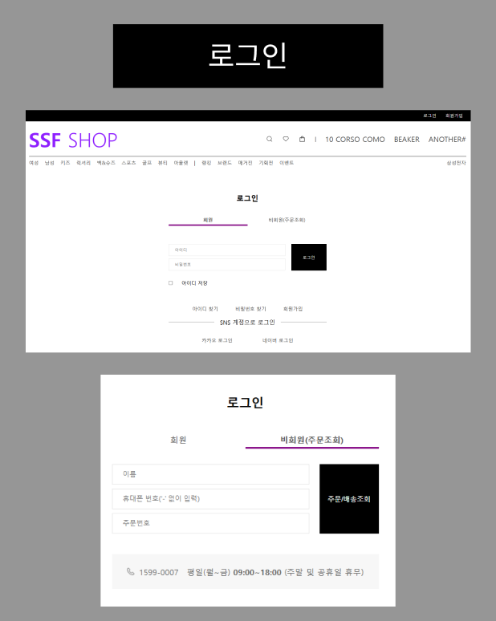

**2️⃣ 회원가입**

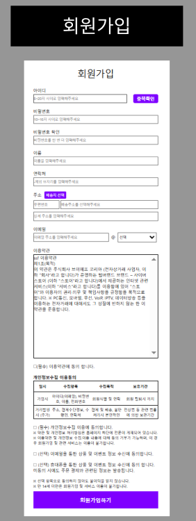

**3️⃣ 메인**

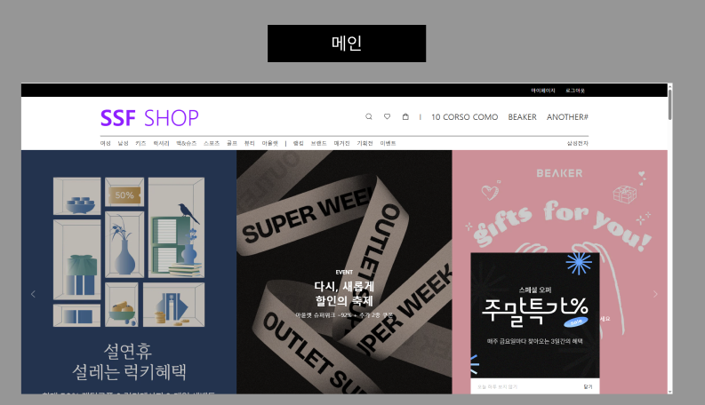

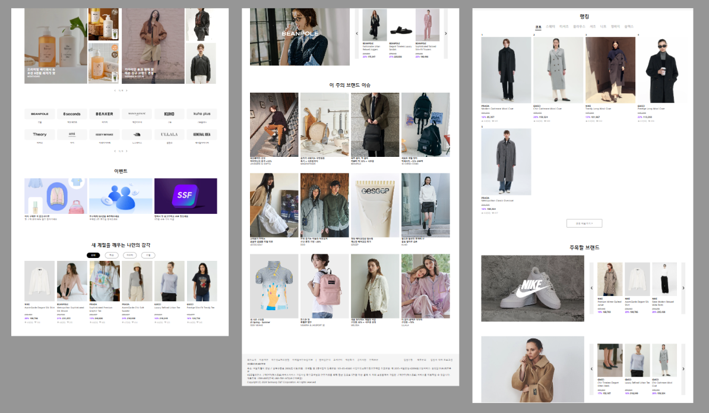

**4️⃣ 상세페이지**


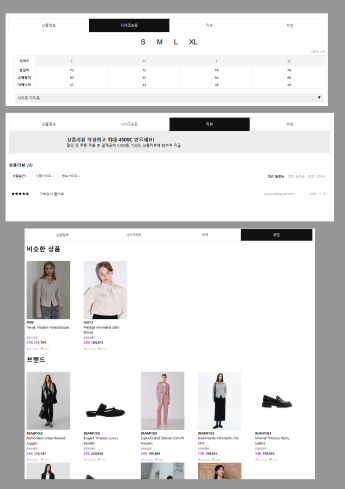

5️⃣ **장바구니**

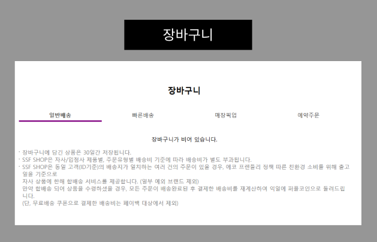

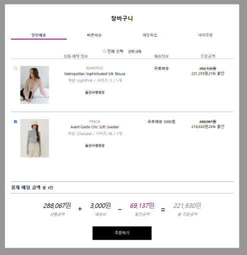

6️⃣ **주문**

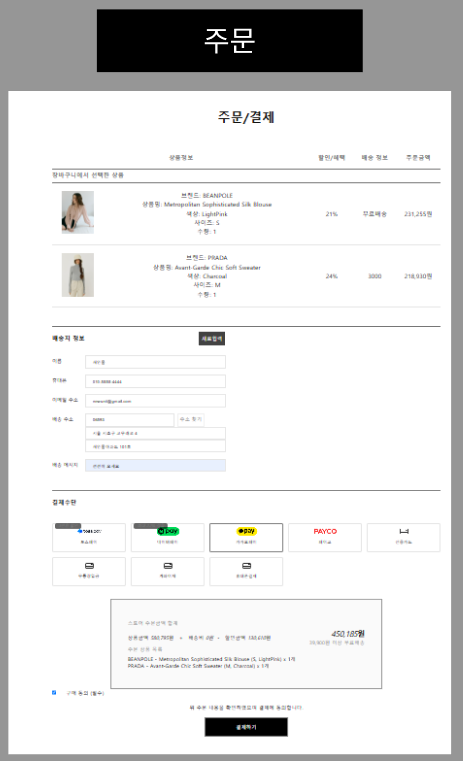

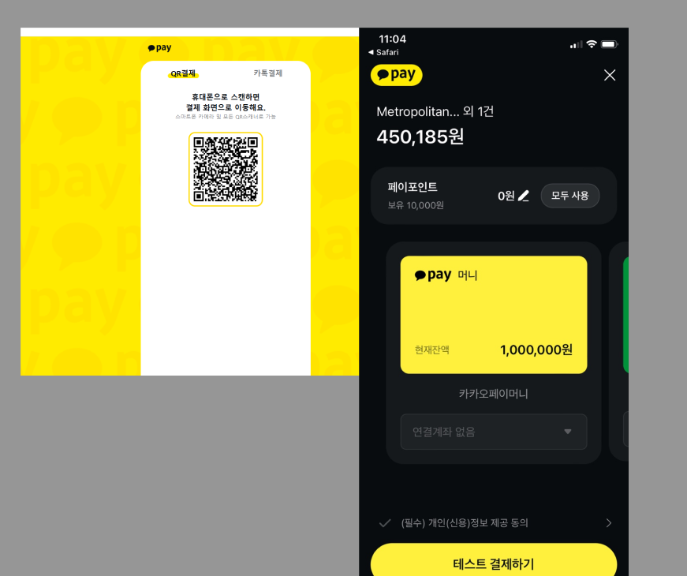

7️⃣ **마이페이지**

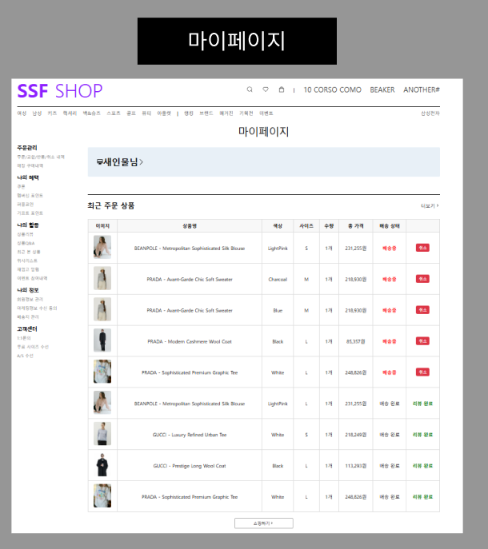

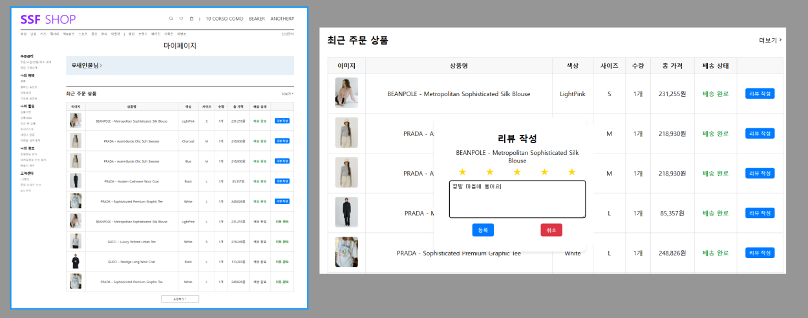

8️⃣ **검색 페이지**

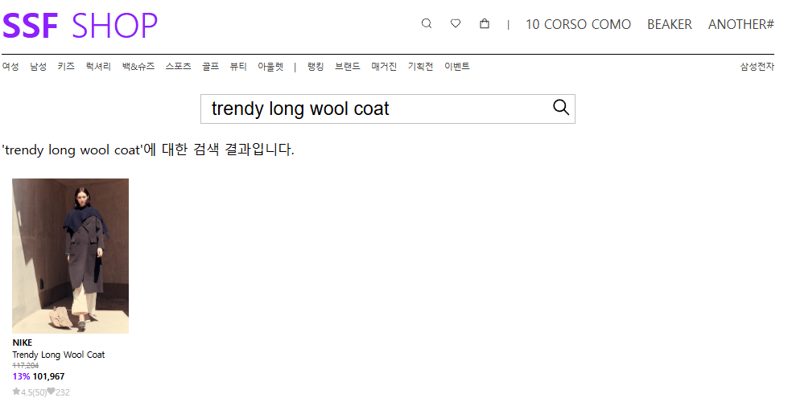

9️⃣ **관리자 페이지**

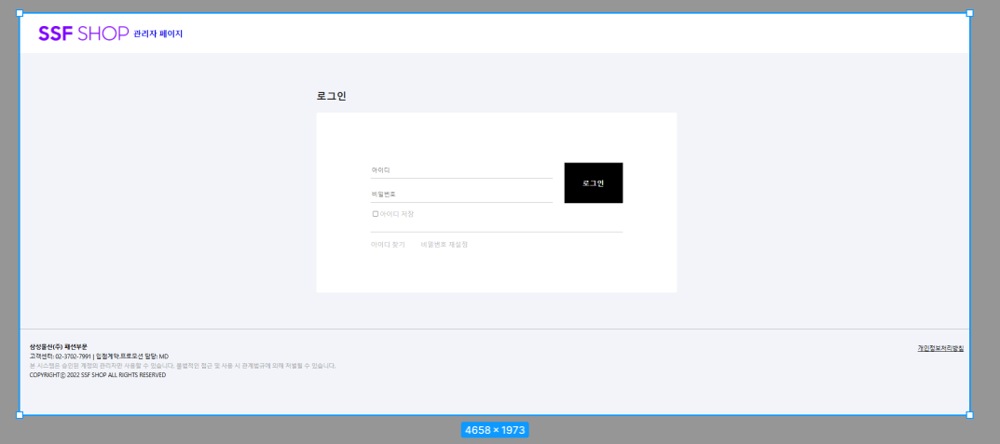

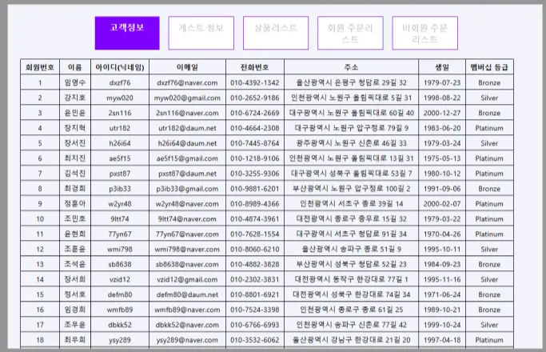

---

---
## http://ssf-client.s3-website.ap-northeast-2.amazonaws.com/ 고객페이지 배포 주소
## http://ssf-admin-client.s3-website.ap-northeast-2.amazonaws.com/ 관리자 페이지 배포 주소

관리자 -> 고객페이지 순으로 열어야 함.

---
## 🚀 실행 방법

### 클라이언트 실행

```bash
cd client
npm install
npm start

cd server
node server.js

✅ 배포 링크
고객 페이지: http://ssf-client.s3-website.ap-northeast-2.amazonaws.com/

관리자 페이지: http://ssf-admin-client.s3-website.ap-northeast-2.amazonaws.com/
```
